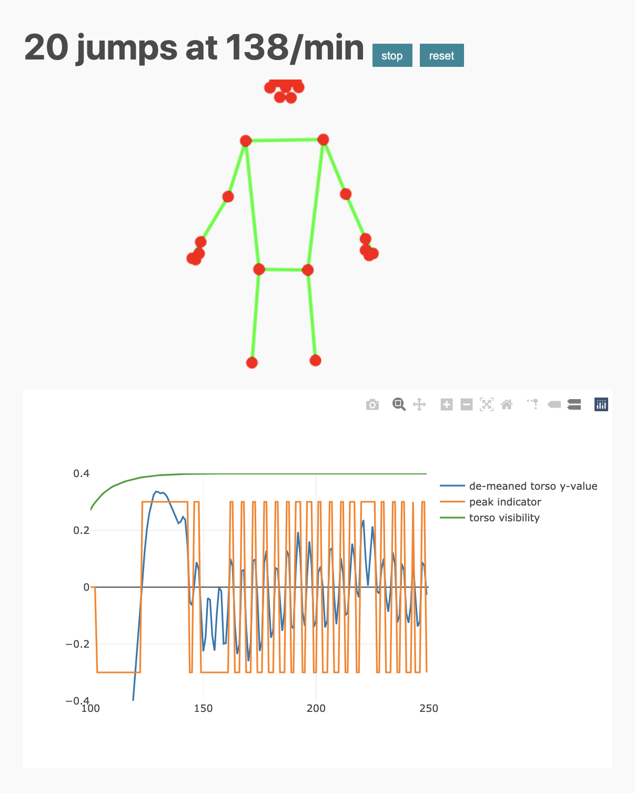

### Jump counter with pose recognition

Using accelerometers to count jumps with a jumprope is either clunky (phone bounces in your pocket)
or expensive (smartwatch). This is a self-contained webpage that does pose recognition
in-browser and classifies jumps via peak detection of the mean torso vertical position.
Pose recognition uses [MediaPipe](https://github.com/google/mediapipe).

Visit [this page](https://aminnj.github.io/jumpcount/), enable camera access, then
make sure the four corners around your torso are visible and begin jumping.

Currently this doesn't work on mobile browsers, but MediaPipe is hoping to have that functionality soon.

